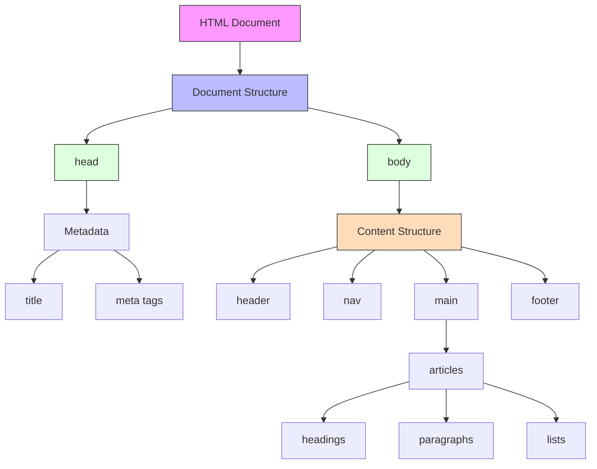

## Description [en]
Which of the following best describes HTML and its primary purpose in web development?

## 题目描述 [zh]
以下哪个选项最准确地描述了HTML及其在网页开发中的主要用途？

## Beschreibung [de]
Welche der folgenden Aussagen beschreibt HTML und seinen Hauptzweck in der Webentwicklung am besten?

## Description [fr]
Laquelle des propositions suivantes décrit le mieux HTML et son objectif principal dans le développement web ?

## Descripción [es]
¿Cuál de las siguientes opciones describe mejor HTML y su propósito principal en el desarrollo web?

## Options / 选项 / Optionen / Options / Opciones

### A
[en] HTML is a programming language used to create interactive web applications and handle server-side logic.

[zh] HTML是一种用于创建交互式Web应用程序和处理服务器端逻辑的编程语言。

[de] HTML ist eine Programmiersprache zur Erstellung interaktiver Webanwendungen und zur Verarbeitung serverseitiger Logik.

[fr] HTML est un langage de programmation utilisé pour créer des applications web interactives et gérer la logique côté serveur.

[es] HTML es un lenguaje de programación utilizado para crear aplicaciones web interactivas y manejar la lógica del lado del servidor.

### B
[en] HTML (Hyper Text Markup Language) is a markup language used to define the structure and content of web pages, serving as the fundamental building block for displaying text, images, and other content on the web.

[zh] HTML（超文本标记语言）是一种用于定义网页结构和内容的标记语言，是在网络上显示文本、图像和其他内容的基本构建块。

[de] HTML (Hyper Text Markup Language) ist eine Auszeichnungssprache zur Definition der Struktur und des Inhalts von Webseiten und dient als grundlegender Baustein für die Darstellung von Text, Bildern und anderen Inhalten im Web.

[fr] HTML (Hyper Text Markup Language) est un langage de balisage utilisé pour définir la structure et le contenu des pages web, servant de bloc de construction fondamental pour l'affichage de texte, d'images et d'autres contenus sur le web.

[es] HTML (Hyper Text Markup Language) es un lenguaje de marcado utilizado para definir la estructura y el contenido de las páginas web, sirviendo como bloque de construcción fundamental para mostrar texto, imágenes y otro contenido en la web.

### C
[en] HTML is a styling language used to design the visual appearance and layout of websites, including colors, fonts, and animations.

[zh] HTML是一种样式语言，用于设计网站的视觉外观和布局，包括颜色、字体和动画。

[de] HTML ist eine Gestaltungssprache zur Gestaltung des visuellen Erscheinungsbilds und Layouts von Websites, einschließlich Farben, Schriftarten und Animationen.

[fr] HTML est un langage de style utilisé pour concevoir l'apparence visuelle et la mise en page des sites web, y compris les couleurs, les polices et les animations.

[es] HTML es un lenguaje de estilo utilizado para diseñar la apariencia visual y el diseño de sitios web, incluyendo colores, fuentes y animaciones.

### D
[en] HTML is a database query language used to store and retrieve web content from servers.

[zh] HTML是一种数据库查询语言，用于从服务器存储和检索网页内容。

[de] HTML ist eine Datenbankabfragesprache zum Speichern und Abrufen von Webinhalten von Servern.

[fr] HTML est un langage de requête de base de données utilisé pour stocker et récupérer du contenu web à partir de serveurs.

[es] HTML es un lenguaje de consulta de base de datos utilizado para almacenar y recuperar contenido web de los servidores.

## Correct Answer / 正确答案 / Richtige Antwort / Bonne réponse / Respuesta correcta
B

## Explanation / 解析 / Erklärung / Explication / Explicación

### [en]
The correct answer is B: HTML (Hyper Text Markup Language) is a markup language used to define the structure and content of web pages.

Key points:
1. HTML is a markup language, not a programming language
2. Its primary purpose is to structure content
3. It uses tags to define elements
4. It's the foundation of web content display

Why other options are incorrect:
- A: HTML is not a programming language and doesn't handle server-side logic
- C: CSS, not HTML, is used for styling and visual design
- D: SQL, not HTML, is used for database queries

### [zh]
正确答案是B：HTML（超文本标记语言）是一种用于定义网页结构和内容的标记语言。

要点：
1. HTML是标记语言，而不是编程语言
2. 其主要目的是构建内容结构
3. 使用标签来定义元素
4. 是网页内容显示的基础

其他选项错误原因：
- A：HTML不是编程语言，也不处理服务器端逻辑
- C：CSS而不是HTML用于样式和视觉设计
- D：SQL而不是HTML用于数据库查询

### [de]
Die richtige Antwort ist B: HTML (Hyper Text Markup Language) ist eine Auszeichnungssprache zur Definition der Struktur und des Inhalts von Webseiten.

Kernpunkte:
1. HTML ist eine Auszeichnungssprache, keine Programmiersprache
2. Hauptzweck ist die Strukturierung von Inhalten
3. Verwendet Tags zur Definition von Elementen
4. Ist die Grundlage für die Anzeige von Webinhalten

Warum andere Optionen falsch sind:
- A: HTML ist keine Programmiersprache und verarbeitet keine serverseitige Logik
- C: CSS, nicht HTML, wird für Styling und visuelles Design verwendet
- D: SQL, nicht HTML, wird für Datenbankabfragen verwendet

### [fr]
La bonne réponse est B : HTML (Hyper Text Markup Language) est un langage de balisage utilisé pour définir la structure et le contenu des pages web.

Points clés :
1. HTML est un langage de balisage, pas un langage de programmation
2. Son objectif principal est de structurer le contenu
3. Il utilise des balises pour définir les éléments
4. C'est la base de l'affichage du contenu web

Pourquoi les autres options sont incorrectes :
- A : HTML n'est pas un langage de programmation et ne gère pas la logique côté serveur
- C : CSS, et non HTML, est utilisé pour le style et le design visuel
- D : SQL, et non HTML, est utilisé pour les requêtes de base de données

### [es]
La respuesta correcta es B: HTML (Hyper Text Markup Language) es un lenguaje de marcado utilizado para definir la estructura y el contenido de las páginas web.

Puntos clave:
1. HTML es un lenguaje de marcado, no un lenguaje de programación
2. Su propósito principal es estructurar el contenido
3. Utiliza etiquetas para definir elementos
4. Es la base para mostrar contenido web

Por qué las otras opciones son incorrectas:
- A: HTML no es un lenguaje de programación y no maneja lógica del lado del servidor
- C: CSS, no HTML, se usa para el estilo y diseño visual
- D: SQL, no HTML, se usa para consultas de base de datos

## Code Example / 代码示例 / Code-Beispiel / Exemple de code / Ejemplo de código

```html
<!DOCTYPE html>
<html>
<head>
    <title>Basic HTML Example</title>
</head>
<body>
    <!-- Structure elements -->
    <header>
        <h1>Welcome to HTML</h1>
    </header>
    
    <nav>
        <ul>
            <li><a href="#home">Home</a></li>
            <li><a href="#about">About</a></li>
        </ul>
    </nav>
    
    <main>
        <article>
            <h2>What is HTML?</h2>
            <p>HTML is a markup language for:</p>
            <ul>
                <li>Structuring content</li>
                <li>Creating links</li>
                <li>Embedding media</li>
            </ul>
        </article>
    </main>
    
    <footer>
        <p>© 2024 HTML Basics</p>
    </footer>
</body>
</html>
```

## Visual Explanation / 可视化解释 / Visuelle Erklärung / Explication visuelle / Explicación visual

