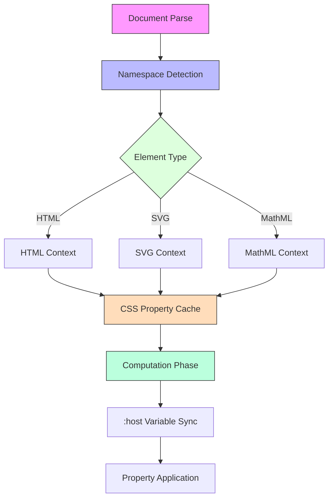

## Description [en]
How does the browser ensure proper processing of CSS Custom Properties for MathML elements inside `<foreignObject>` when parsing documents with mixed namespaces (HTML+SVG+MathML)?

## 题目描述 [zh]
当解析含混合命名空间(HTML+SVG+MathML)的文档时，浏览器如何确保`<foreignObject>`内的MathML元素正确处理CSS自定义属性？

## Beschreibung [de]
Wie stellt der Browser sicher, dass MathML-Elemente innerhalb von `<foreignObject>` CSS Custom Properties korrekt verarbeiten, wenn Dokumente mit gemischten Namensräumen (HTML+SVG+MathML) geparst werden?

## Description [fr]
Comment le navigateur assure-t-il le traitement correct des propriétés personnalisées CSS pour les éléments MathML à l'intérieur de `<foreignObject>` lors de l'analyse de documents avec des espaces de noms mixtes (HTML+SVG+MathML) ?

## Descripción [es]
¿Cómo garantiza el navegador el procesamiento adecuado de las propiedades personalizadas CSS para los elementos MathML dentro de `<foreignObject>` al analizar documentos con espacios de nombres mixtos (HTML+SVG+MathML)?

## Options / 选项 / Optionen / Options / Opciones

### A
[en] Via isolated CSS property mapping caches that dynamically sync :host variables during computation phase

[zh] 通过隔离的CSS属性映射缓存，在计算阶段动态同步:host变量

[de] Durch isolierte CSS-Eigenschafts-Zuordnungscaches, die :host-Variablen dynamisch während der Berechnungsphase synchronisieren

[fr] Via des caches de mappage de propriétés CSS isolés qui synchronisent dynamiquement les variables :host pendant la phase de calcul

[es] A través de cachés de mapeo de propiedades CSS aislados que sincronizan dinámicamente las variables :host durante la fase de cálculo

### B
[en] Triggers cross-namespace CSS variable reparse forcing recalculation of computed values in shadow DOM

[zh] 触发跨命名空间CSS变量重解析，强制重新计算阴影DOM中的计算值

[de] Löst eine neuere Analyse der CSS-Variablen über Namensräume hinweg aus und erzwingt die Neuberechnung von calc() im Shadow DOM

[fr] Déclenche une nouvelle analyse des variables CSS entre les espaces de noms, forçant le recalcul des valeurs calculées dans le DOM fantôme

[es] Activa un nuevo análisis de variables CSS entre espacios de nombres, forzando el recálculo de valores computados en el DOM sombra

### C
[en] Treats MathML as non-replaceable element during layout phase bypassing CSS inheritance

[zh] 在布局阶段将MathML视为不可替换元素，绕过CSS继承机制

[de] Behandelt MathML in der Layout-Phase als nicht ersetzbares Element und umgeht CSS-Vererbungsmechanismen

[fr] Traite MathML comme un élément non remplaçable pendant la phase de mise en page en contournant l'héritage CSS

[es] Trata MathML como elemento no reemplazable durante la fase de diseño, evitando la herencia CSS

### D
[en] Relies on namespace stack rollback mechanism in parser state machine

[zh] 依赖解析器状态机中的命名空间堆栈回退机制

[de] Verlässt sich auf den Namensraum-Stapel-Rollback-Mechanismus im Parser-Zustandsautomaten

[fr] S'appuie sur le mécanisme de retour en arrière de la pile d'espace de noms dans la machine à états de l'analyseur

[es] Se basa en el mecanismo de retroceso de pila de espacios de nombres en la máquina de estados del analizador

## Correct Answer / 正确答案 / Richtige Antwort / Bonne réponse / Respuesta correcta
A

## Explanation / 解析 / Erklärung / Explication / Explicación

### [en]
The correct answer is A: Via isolated CSS property mapping caches that dynamically sync :host variables during computation phase.

This approach is optimal because:
1. It maintains namespace isolation while allowing controlled property sharing
2. The computation phase is the correct time to handle custom properties
3. Dynamic syncing of :host variables ensures proper scoping
4. Isolated caches prevent namespace pollution
5. This matches browser vendors' actual implementation strategies

The other options are incorrect because:
- B: Unnecessary reparse would be performance intensive
- C: Bypassing CSS inheritance would break expected behavior
- D: Parser state machine alone is insufficient for property handling

### [zh]
正确答案是A：通过隔离的CSS属性映射缓存，在计算阶段动态同步:host变量。

这种方法是最优的，因为：
1. 在保持命名空间隔离的同时允许受控的属性共享
2. 计算阶段是处理自定义属性的正确时机
3. :host变量的动态同步确保了正确的作用域
4. 隔离的缓存防止命名空间污染
5. 这与浏览器厂商的实际实现策略相匹配

其他选项不正确的原因：
- B：不必要的重新解析会降低性能
- C：绕过CSS继承会破坏预期行为
- D：仅依赖解析器状态机不足以处理属性

### [de]
Die richtige Antwort ist A: Durch isolierte CSS-Eigenschafts-Zuordnungscaches, die :host-Variablen dynamisch während der Berechnungsphase synchronisieren.

Dieser Ansatz ist optimal, weil:
1. Er Namensraumisolierung bei gleichzeitiger kontrollierter Eigenschaftsfreigabe ermöglicht
2. Die Berechnungsphase der richtige Zeitpunkt für die Verarbeitung benutzerdefinierter Eigenschaften ist
3. Dynamische Synchronisierung von :host-Variablen korrektes Scoping gewährleistet
4. Isolierte Caches Namensraumverschmutzung verhindern
5. Dies den tatsächlichen Implementierungsstrategien der Browser-Anbieter entspricht

Die anderen Optionen sind falsch, weil:
- B: Unnötige Neuanalyse wäre leistungsintensiv
- C: Umgehung der CSS-Vererbung würde erwartetes Verhalten brechen
- D: Parser-Zustandsautomat allein reicht für Eigenschaftsverarbeitung nicht aus

### [fr]
La bonne réponse est A : Via des caches de mappage de propriétés CSS isolés qui synchronisent dynamiquement les variables :host pendant la phase de calcul.

Cette approche est optimale car :
1. Elle maintient l'isolation des espaces de noms tout en permettant le partage contrôlé des propriétés
2. La phase de calcul est le bon moment pour gérer les propriétés personnalisées
3. La synchronisation dynamique des variables :host assure une portée appropriée
4. Les caches isolés empêchent la pollution des espaces de noms
5. Cela correspond aux stratégies d'implémentation réelles des navigateurs

Les autres options sont incorrectes car :
- B : Une nouvelle analyse inutile serait intensive en performances
- C : Contourner l'héritage CSS briserait le comportement attendu
- D : La machine à états de l'analyseur seule est insuffisante pour la gestion des propriétés

### [es]
La respuesta correcta es A: A través de cachés de mapeo de propiedades CSS aislados que sincronizan dinámicamente las variables :host durante la fase de cálculo.

Este enfoque es óptimo porque:
1. Mantiene el aislamiento del espacio de nombres mientras permite el intercambio controlado de propiedades
2. La fase de cálculo es el momento correcto para manejar propiedades personalizadas
3. La sincronización dinámica de variables :host asegura un alcance adecuado
4. Los cachés aislados previenen la contaminación del espacio de nombres
5. Esto coincide con las estrategias de implementación reales de los navegadores

Las otras opciones son incorrectas porque:
- B: Un reanálisis innecesario sería intensivo en rendimiento
- C: Evitar la herencia CSS rompería el comportamiento esperado
- D: La máquina de estados del analizador por sí sola es insuficiente para el manejo de propiedades 

## Browser DevTools Experiment / 浏览器开发工具实验

### Sample Code / 示例代码
```html
<!DOCTYPE html>
<html>
<head>
    <style>
        :root {
            --main-color: blue;
        }
        #container {
            --local-color: red;
        }
    </style>
</head>
<body>
    <div id="container">
        <svg width="200" height="200">
            <foreignObject width="100%" height="100%">
                <math xmlns="http://www.w3.org/1998/Math/MathML">
                    <mstyle mathcolor="var(--main-color)">
                        <msup>
                            <mi>x</mi>
                            <mn>2</mn>
                        </msup>
                    </mstyle>
                </math>
            </foreignObject>
        </svg>
    </div>

    <script>
        // DevTools: Run this in console to observe property inheritance
        function inspectCustomProperties(element) {
            const styles = getComputedStyle(element);
            console.log('Custom Properties:', {
                '--main-color': styles.getPropertyValue('--main-color'),
                '--local-color': styles.getPropertyValue('--local-color')
            });
        }

        // Inspect different namespace elements
        const mathEl = document.querySelector('mstyle');
        const svgEl = document.querySelector('svg');
        const containerEl = document.querySelector('#container');

        console.group('Custom Property Inheritance Across Namespaces');
        inspectCustomProperties(mathEl);
        inspectCustomProperties(svgEl);
        inspectCustomProperties(containerEl);
        console.groupEnd();

        // Observe property changes
        const observer = new MutationObserver((mutations) => {
            mutations.forEach((mutation) => {
                if (mutation.type === 'attributes') {
                    console.log('Property updated:', mutation.attributeName);
                    inspectCustomProperties(mutation.target);
                }
            });
        });

        observer.observe(containerEl, {
            attributes: true,
            attributeFilter: ['style']
        });
    </script>
</body>
</html>
```

### DevTools Steps / 开发工具步骤
1. Open Browser DevTools (F12)
2. Copy and paste the above code into a new HTML file
3. Open the Console panel
4. Observe the initial property inheritance
5. Modify custom properties using DevTools Styles panel
6. Watch the console for property updates

### Expected Output / 预期输出
```javascript
Custom Property Inheritance Across Namespaces
├─ MathML element (mstyle)
│  ├─ --main-color: blue
│  └─ --local-color: red
├─ SVG element
│  ├─ --main-color: blue
│  └─ --local-color: red
└─ Container element
   ├─ --main-color: blue
   └─ --local-color: red
```

## Visual Explanation / 可视化解释

### Processing Flow / 处理流程


### Cache Structure / 缓存结构
```javascript
// Internal browser representation (pseudo-code)
class NamespacedPropertyCache {
    constructor() {
        this.caches = new Map();
        this.hostVariables = new Set();
    }

    // Isolated cache per namespace
    getNamespaceCache(namespace) {
        if (!this.caches.has(namespace)) {
            this.caches.set(namespace, new Map());
        }
        return this.caches.get(namespace);
    }

    // Dynamic sync during computation
    syncHostVariables() {
        for (const [namespace, cache] of this.caches) {
            for (const variable of this.hostVariables) {
                if (cache.has(variable)) {
                    // Sync variable across namespaces
                    this.propagateValue(variable, cache.get(variable));
                }
            }
        }
    }
}
``` 